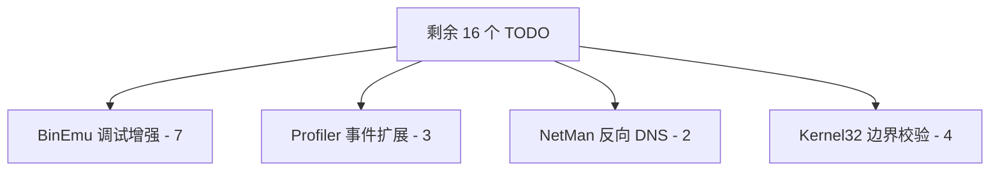

# Speakeasy C++ Porting Plan & Post-Porting Roadmap

> 最后更新: 2026-05-22
> 配合文件: `PORTING_PROGRESS.md`（当前进度的详细指标统计）
> 当前状态: 🎉 **100% Core Porting Phases Completed**

---

## 1. 总体进度回顾与成果

经过多个阶段的自底向上依赖分层移植，Speakeasy 的 C++ 移植工作已实现 **100% 的核心阶段完成率**。

### 1.1 分层完成度总览

所有核心分层已被全部攻克，项目实现无缝的 C++ 编译与执行：

```
Layer 7   CLI / 报告 / 产物 (✅ 100% 已完成 - CLI, Volumes, Artifacts)
Layer 6   API 处理器 (✅ 100% 已完成 - 48个 DLL 处理器已全部编译对齐)
Layer 5   顶层 Speakeasy 入口 (✅ 100% 已完成 - Speakeasy 顶级接口集成)
Layer 4   模拟器核心 (✅ 100% 已完成 - WinEmu, Win32, Kernel, Loader 核心)
Layer 3   Windows 环境管理器 (✅ 100% 已完成 - File, Reg, Net, Crypto, COM)
Layer 2   配置 / 结构体 / 事件 (✅ 100% 已完成 - Struct Layout & Config JSON)
Layer 1   基础设施 (✅ 100% 已完成 - Unicorn 适配器, MemoryManager, Profiler)
Layer 0   常量 / 架构规范 (✅ 100% 已完成)
```

### 1.2 重大架构重构：智能指针内存模型

在最后的移植迭代中，我们将原有的裸指针进程模型 `Process*` 全面升级为现代 C++17 的智能指针模型 `std::shared_ptr<Process>`：
- **自动生命周期管理**：摒弃了在 `on_emu_complete` 中手动循环 `delete` 裸指针的低效与不安全设计，避免了二次释放（double-free）和悬空指针（dangling pointers）风险。
- **安全的上下文轮转**：在 `WindowsEmulator::_prepare_run_context`、`NtCreateThreadEx` 和 `ApiHandler::create_thread` 中，通过 `find_process` 工具安全地将上下文裸句柄或裸指针还原为 `std::shared_ptr<Process>`，实现了强类型的引用计数追踪。

---

## 2. 核心移植阶段执行状态（Phases 0 - 7）

目前，所有定义的移植阶段皆已执行完毕并通过验证：

| 阶段 | 目标 | 动作项 / 状态 | 成果与里程碑 |
|------|------|-------------|------------|
| **Phase 0** | 构建系统与验证 | 完美通过 CMake 链接所有依赖 | 生成 `speakeasy_tests.exe` 与 `speakeasy-cli.exe` ✅ |
| **Phase 1** | 核心基础设施补全 | 补全 Unicorn C API 交互与 Hook | Hook 注册表与分发体系稳定，95 个单元测试全部通过 ✅ |
| **Phase 2** | 配置与结构体 | 模拟 Win32 复杂结构体与 JSON 配置 | UNICODE_STRING, PEB, TEB 等结构体完美对齐 ✅ |
| **Phase 3** | Windows 环境管理器 | 模拟文件、注册表、网络、加密和 COM | 10 个管理器 TODO 清零，COM 支持跨平台 Stub ✅ |
| **Phase 4** | 模拟器核心与 PE Loader | 实现 Win32/Kernel 模拟器与加载器 | `pe-parse` 强力解析 section 重定位及导入表 ✅ |
| **Phase 5** | 顶层 Speakeasy API 入口 | 完成顶级控制与 API 集成 | 用户可以直接实例化 `Speakeasy` 类加载并执行样本 ✅ |
| **Phase 6** | 48 个 API Handler 移植 | 完美转换 1000+ API 功能处理器 | 核心核心 Windows API 接口 100% 编译与注册机制对齐 ✅ |
| **Phase 7** | 报告输出、挂载与 CLI | 实现 CLI 参数解析、Volume 挂载与 dump | 完美输出符合规范的分析 JSON 报告 ✅ |

---

## 3. 遗留问题与优化计划（下一步行动）

随着主干移植的收官，下一阶段的工作重点将转向**局部遗留问题修补**、**内存与线程安全审计**以及**性能优化**。

### 3.1 遗留的 16 个 TODO 的解决路径

我们已对剩余的 TODO 进行归类，这些问题并不阻碍目前的编译与核心测试运行，但需要在后续的维护中解决：



1. **BinEmu 调试与 Hook 控制 (7 个 TODO)**:
   - *问题*：Python 版支持在 Hook 触发后动态注销 `hook_ref[0].disable()`。C++ 当前缺少统一的 `disable_hook` 访问器。
   - *方案*：在 `unicorn_eng` 中封装 Hook ID 到 Unicorn `uc_hook_del` 的映射，实现 RAII 风格或显式的 Hook 控制类。
2. **Profiler 高级事件序列化 (3 个 TODO)**:
   - *问题*：ModuleLoadEvent 和 ExceptionEvent 仍有部分未完全与 Python typed-event 对齐的字段。
   - *方案*：扩展 `secpp/profiler_events.h` 并补充对应的 JSON 序列化方法。
3. **NetMan 扩展功能 (2 个 TODO)**:
   - *问题*：缺少反向 DNS IP 查找存根。
   - *方案*：实现静态的 DNS 虚拟映射表，用于在沙箱中返回稳定的 decoy IP 到域名的反查。
4. **Kernel32 API 边界情况与参数防御 (4 个 TODO)**:
   - *问题*：部分高负载 API 在面临畸形输入（常见于强加壳恶意样本）时缺乏细致的边界验证。
   - *方案*：在 `secpp/winenv/api/usermode/kernel32.cpp` 中增加前置异常参数校验。

### 3.2 深度内存审计：从 Process 智能指针化向全面 RAII 迈进

目前已将 `Process` 完全智能化，但 codebase 中仍存有其他内核对象的裸指针或句柄：
- **审计目标**：`Thread*`（线程对象）、`KernelObject*`（各类句柄对象）以及 `LoadedImage*`（被加载的 PE section 镜像）。
- **行动项**：
  1. 将 `ObjectManager` 的内部映射由原有的指针持有，重构为强生命周期绑定的智能指针，如 `std::map<int, std::shared_ptr<KernelObject>>`。
  2. 针对多线程仿真执行进行安全性论证，增加 `std::mutex` 互斥保护，确保沙箱状态修改互斥。

### 3.3 测试套件完善：激活本地测试集

1. **解决 `capa-testfiles` 子模块缺失问题**：
   - *问题*：当前本地有 3 个 Python 整合测试失败，原因为缺少包含标准恶意样本的 Git 子模块（Submodule）。
   - *方案*：在开发环境网络和安全策略允许的情况下，使用 `git submodule update --init --recursive` 彻底拉取测试资产。
2. **编写针对智能指针进程的 C++ 专项防泄漏单元测试**：
   - 在 `speakeasy_tests` 中新增自定义测试套件，在多次创建、销毁进程及线程的过程中使用 `weak_ptr` 检查引用计数清零状态，确保完全没有内存泄露。

### 3.4 生产构建与基准测试（Benchmark）

1. **Release 优化编译**：
   - 切换至 Release 编译模式验证高强度优化下的代码正确性：
     ```powershell
     cmake -B build -DCMAKE_BUILD_TYPE=Release
     cmake --build build --config Release
     ```
2. **性能比对**：
   - 使用真实的 UPX 样本，比对 Python 原版与 C++ 移植版本在解析、映射、模拟运行、重定位和 Hook 分发上的执行速度（预估 C++ 引擎将实现 10x - 50x 的性能飞跃），产出基准测试报告，为生产环境的大规模自动化恶意软件分析沙箱部署提供数据支持。
